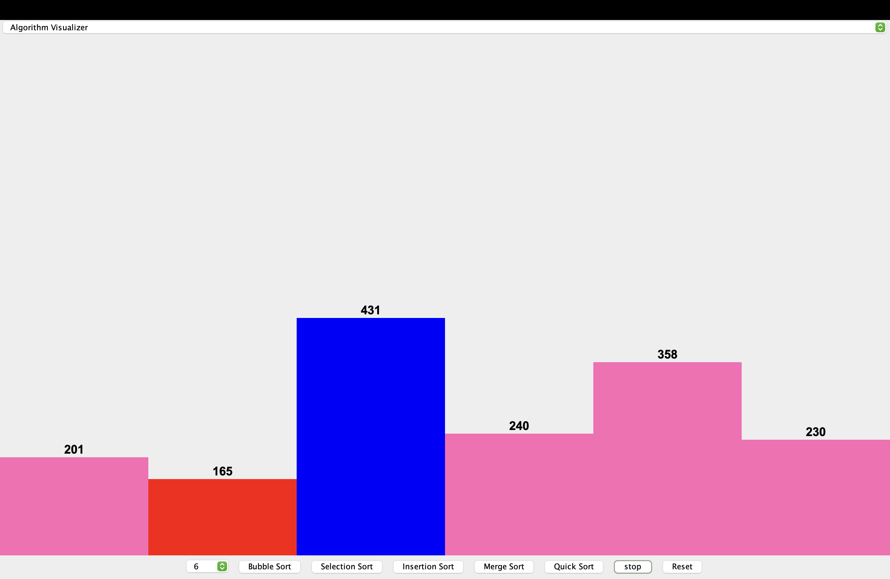
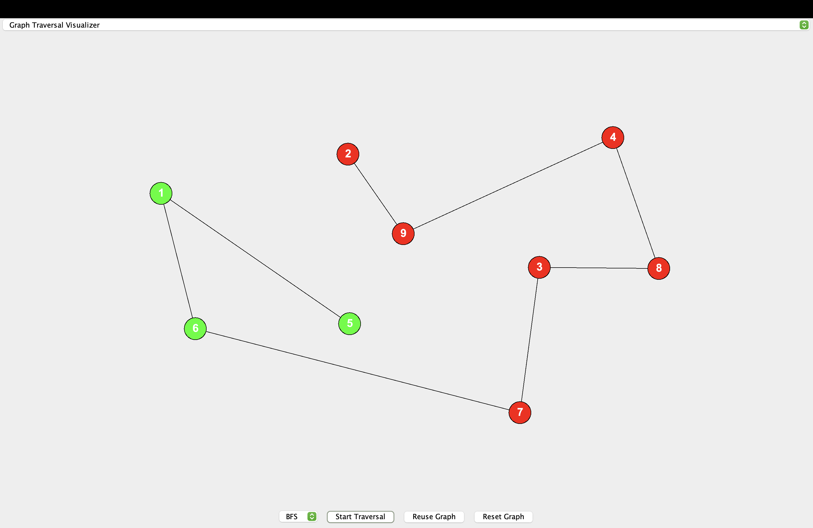

# Algorithm & Graph Traversal Visualizer

This is a Java Swing based desktop application that visualizes
sorting algorithms and graph traversal algorithms using animations.

The project helps users understand how algorithms work internally
through interactive and step-by-step visualization.

---

## Features

### Sorting Algorithm Visualizer
- Visualizes Bubble Sort, Selection Sort, Insertion Sort, Merge Sort, and Quick Sort
- Animated bar representation of array elements
- Start, Stop, and Reset controls
- Displays values on bars for clarity

### Graph Traversal Visualizer
- Right-click on panel to create nodes
- Click on two nodes to connect them with an edge
- Supports BFS and DFS traversal
- Animated traversal showing visited nodes
- Fully user-interactive graph creation

---

## Technologies Used
- Java
- Java Swing
- Object-Oriented Programming
- Event Handling

---

## How to Run the Project

```bash
javac MainVisualizer.java
java MainVisualizer
```

---

## Screenshots

### Sorting Algorithm Visualizer


### Graph Traversal Visualizer

